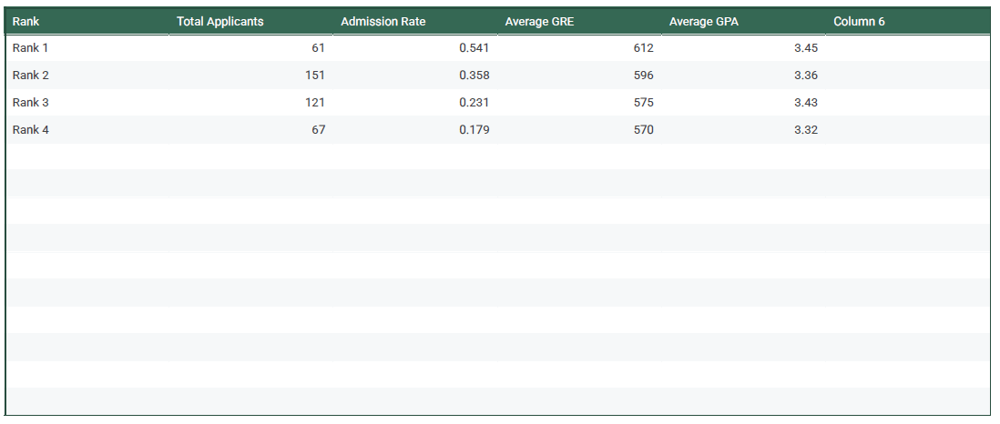
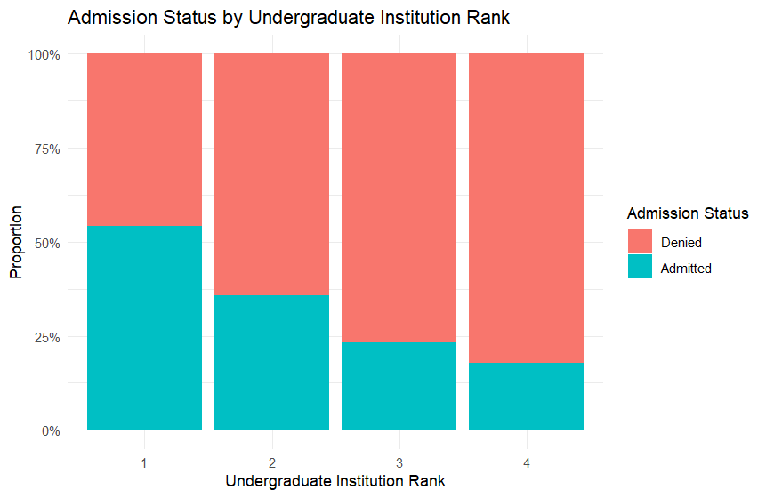
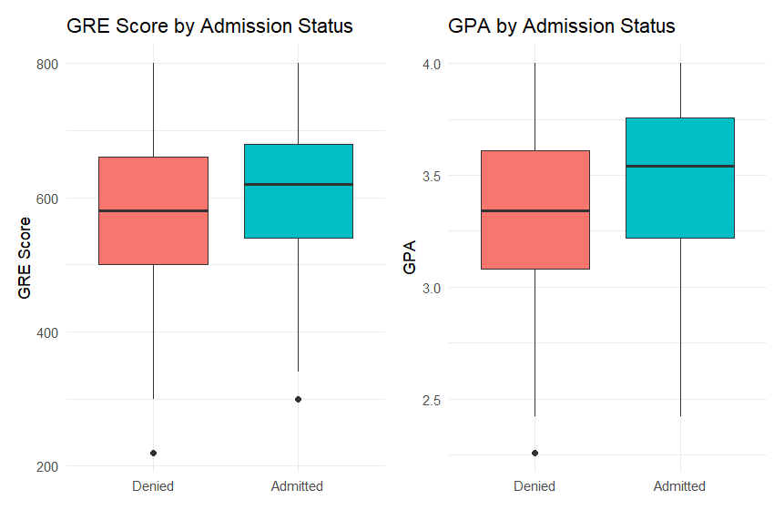
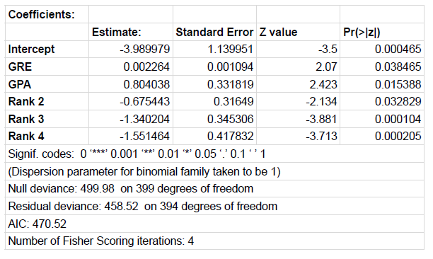
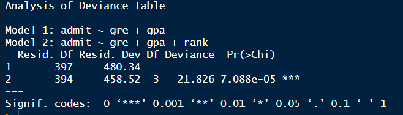
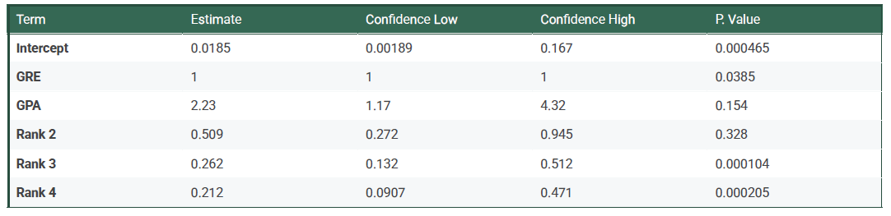

```{r setup, include=FALSE}
knitr::opts_chunk$set(echo = TRUE, message = FALSE, warning = FALSE)
```

First, the necessary libraries used for this project are loaded. 

```
library(dplyr)      
library(ggplot2)    
library(patchwork)  
library(broom)
```

Next, the data is imported using a relative path.

```
grad_data <- read.csv("./Data/GradSchool_Admissions.csv")
```

# Cleaning the Data
Then the required data cleaning steps are performed to prepare variables for modeling. The outcome variable, **admit**, and the categorical predictor, **rank**, are converted to factors. 


``` 
0 = Denied, 1 = Admitted. Denied (0) will be the reference level.
data$admit <- factor(data$admit, 
                     levels = c(0, 1), 
                     labels = c("Denied", "Admitted")) 
```

``` 
Convert 'rank' (predictor) to a factor
# Rank 1 (Top-tier) will be the reference level for the model.
data$rank <- factor(data$rank, 
                    levels = 1:4, 
                    labels = paste("Rank", 1:4))
``` 

# Summary Statistics
This section explores the distributions of the predictors (GRE, GPA, and rank) and their relationship with the outcome variable (admittance). But first, we will review the overall summary statistics.
```
print(summary(grad_data))
```

We then examined whether the proportion of admitted versus denied students for each undergraduate institution was affected by the institution rank.
```
rank_summary <- grad_data %>%
  group_by(rank) %>%
  summarise(
    Total_Applicants = n(),
    Admission_Rate = mean(admit == "Admitted"),
    Avg_GRE = mean(gre),
    Avg_GPA = mean(gpa)
  )
print(rank_summary)
```


The summary statistics clearly show a relationship between rank and the admission rate, with Rank 1 institutions having the highest success rate. The following figure shows the proportion of admitted versus denied students for each undergraduate institution rank.



# Box plots
In this case, box plots are used to compare the distributions of the continuous predictors (GRE and GPA) between admitted and denied applicants.

Conclusions: On average, applicants who were admitted to graduate schools had higher GRE scores and higher GPA scores compared to those who were denied.

# Model Building
Because the outcome variable (admittance to graduate school) is binary (yes or no), a Logistic Regression model would work well. The odds of admission will be calculated using GRE, GPA and Rank as functions. 

We used first a model that compared GRE and GPA and then a second model that added institutional rank. These modelw were then compared with each other using the Likeihood Ratio Test which employs the difference in deviance between the two models to test the hypothesis that the added variable is necessary. The residual deviance decreased from 480.34 in Model 1 to 458.52 in Model 2; a decrease of 21.826 which indicates that adding rank did improve the model's fit.  


# Odds Ratio
The Odds Ratio or OR is a measure of association etween an exposure and an outcome. In logistic regression, it predicts the change in the odds of the outcome occurring for every one-unit change in the predictor variable while holding other predictors constant. If the OR is 1 there is no association, if the OR is less than 1, the predictor is associated with increased odds of the desired outcome. If the OR is greater than 1, the precidtor is associated with decreased odds of the desired outcome.

