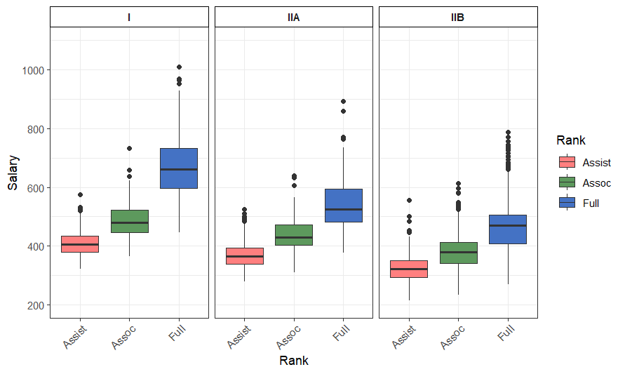
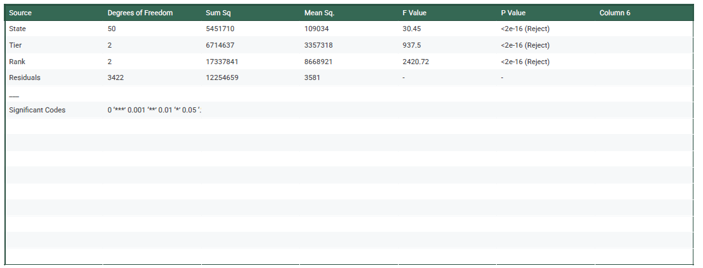
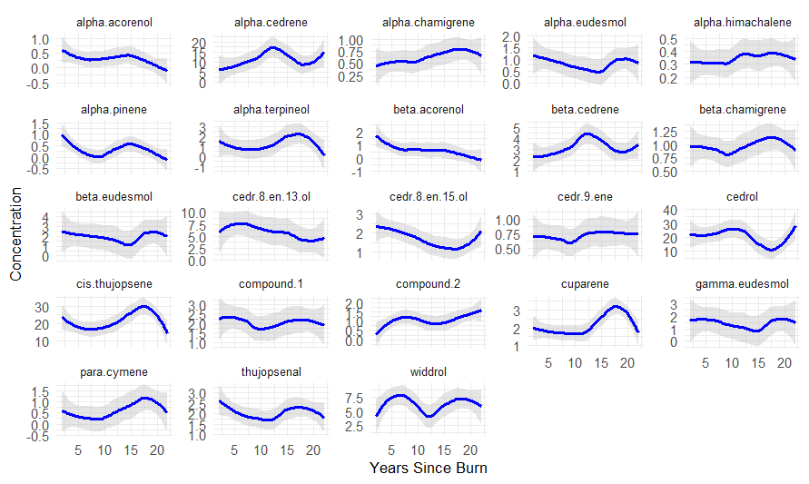
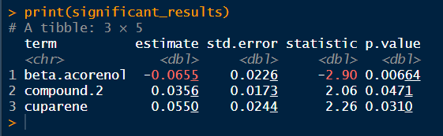

```{r , include=FALSE}
knitr::opts_chunk$set(echo = TRUE)
```

## Loading the necessary libraries
```
library(dplyr)
library(ggplot2)
library(tidyverse)
library(tidyr)
library(patchwork) 
library(broom)
library(janitor)
```

## Setting Directory
```getwd()
setwd("C:/Users/Angie/Desktop/Data_Course_BOLLARD/Exams/Exam_3")
```

## Loading the data using a relative path
```sal_data = read.csv("FacultySalaries_1995.csv")
colnames(sal_data)
```

## Tidying Data
```# 1. Standardize column names
sal_data_cleaned <- sal_data %>%
  clean_names()
  ```

## Correct Data Types and Handle Symbols
```sal_data_cleaned <- sal_data_cleaned %>%
  mutate(
    # Convert identifiers and categorical columns
    fed_id = as.character(fed_id),
    univ_name = as.character(univ_name),
    state = as.factor(state),
```
    
## Convert Salary/Compensation and Count columns to numeric
    ```across(
      starts_with("avg_") | starts_with("num_"),
      ~ suppressWarnings(as.numeric(gsub("[$,]", "", .)))
    )
  )
  ```

## Handle missing values (NA Imputation)
```sal_data_cleaned <- sal_data_cleaned %>%
  mutate(
    across(starts_with("num_"), ~ replace_na(., 0)),
    across(starts_with("avg_"), ~ replace_na(., median(., na.rm = TRUE)))
  )
  ```

## Remove duplicates
```sal_data_cleaned <- sal_data_cleaned %>%
  distinct(fed_id, .keep_all = TRUE)
  ```

## Recode and Factor the 'Tier' variable
```sal_data_cleaned <- sal_data_cleaned %>%
  mutate(
    # Recode the tier values, ensuring they are treated as character strings
    tier = case_when(
      tier == "Tier 1" ~ "I",
      tier == "Tier 2" ~ "IIA",
      tier == "Tier 3" ~ "IIB",
      TRUE ~ as.character(tier) # Fallback, handles original character data
    ),
    # Convert the recoded tier column into an ordered factor for plotting
    tier = factor(tier, levels = c("I", "IIA", "IIB"))
  )
  ```
  
## Filter out rows where "tier" is missing
```sal_data_cleaned <- sal_data_cleaned %>%
  filter(!is.na(tier))
  ```

## Verify the result (should show counts for I, IIA, IIB)
```table(sal_data_cleaned$tier)
```

## --- Final Reshape and Plotting ---

```sal_data_long <- sal_data_cleaned %>%
  select(tier, avg_assist_prof_salary, avg_assoc_prof_salary, avg_full_prof_salary) %>%
  pivot_longer(
    cols = starts_with("avg_"),
    names_to = "Rank_Raw",
    values_to = "Salary"
  ) %>%
  mutate(
    Rank = case_when(
      grepl("assist", Rank_Raw) ~ "Assist",
      grepl("assoc", Rank_Raw) ~ "Assoc",
      grepl("full", Rank_Raw) ~ "Full",
      TRUE ~ Rank_Raw
    ),
    # Ensure Rank is a factor with the correct order
    Rank = factor(Rank, levels = c("Assist", "Assoc", "Full"))
  )
  ```

## Generating the Faceted Box Plot
```p <- ggplot(sal_data_long, aes(x = Rank, y = Salary, fill = Rank)) +
  geom_boxplot() +
  facet_wrap(~ tier, scales = "free_x", nrow = 1) + # This is the critical line!
  labs(
    y = "Salary", x = "Rank", fill = "Rank"
  ) +
  scale_y_continuous(
    limits = c(200, 1100), breaks = seq(200, 1000, 200)
  ) +
  theme_bw() +
  theme(
    axis.text.x = element_text(angle = 45, hjust = 1),
    strip.background = element_rect(fill = "white", color = "black"),
    strip.text = element_text(face = "bold")
  ) +
  scale_fill_manual(
    values = c("Assist" = "#FF7F7F", "Assoc" = "#5D995D", "Full" = "#4472C4")
  )

# Print the plot object
print(p)
```

----------------------------------------------------------------------------------------

## R Code for ANOVA Model

## 1. Reshape data with 'State' column included
```sal_data_long <- sal_data_cleaned %>%
```
  
  ## Ensure 'state' is included here along with 'tier'
  ```select(state, tier, avg_assist_prof_salary, avg_assoc_prof_salary, avg_full_prof_salary) %>%
  ```
  
  ## Pivot the three salary columns into two new columns: 'Rank_Raw' and 'Salary'
  ```pivot_longer(
    cols = starts_with("avg_"),
    names_to = "Rank_Raw",
    values_to = "Salary"
  ) %>%
  ```
  
  ## Clean up the Rank column for plotting (e.g., "avg_assist_prof_salary" -> "Assist")
 ``` mutate(
    Rank = case_when(
      grepl("assist", Rank_Raw) ~ "Assist",
      grepl("assoc", Rank_Raw) ~ "Assoc",
      grepl("full", Rank_Raw) ~ "Full",
      TRUE ~ Rank_Raw
    )
  ) %>%
  ```

  ## Ensure Rank and Tier are factored in the desired display order
  ```mutate(
    Rank = factor(Rank, levels = c("Assist", "Assoc", "Full")),
    # Ensure tier and state are factors (if they aren't already)
    tier = factor(tier, levels = c("I", "IIA", "IIB")),
    state = as.factor(state)
  ) %>%
  ```
  
  ## Filter out NA tier values, as done previously
 ``` filter(!is.na(tier))
 ```

## Install and load the 'car' package if you want Type III ANOVA
```install.packages("car") 
library(car) 
```

## --- Build the Additive ANOVA Model ---
```anova_model <- aov(Salary ~ state + tier + Rank, data = sal_data_long)
```

## --- Display the Summary Output ---
```1. Standard Type I ANOVA Summary (Sequential Sums of Squares)
cat("--- Type I ANOVA Summary (Sequential Sums of Squares) ---\n")
summary(anova_model)
```


----------------------------------------------------------------------------------------
## Load "Juniper_oils.csv" file
```oil_data = read.csv("Juniper_Oils.csv")
colnames(oil_data)
```

## Rename columns to remove dots/make them clean *before* pivoting 
```tidy_oil_data <- oil_data %>%
  # Use pivot_longer to move chemical columns from wide to long format
  pivot_longer(
    # Specify the columns containing the chemical concentrations to be pivoted
    cols = c(
      "alpha.pinene", "para.cymene", "alpha.terpineol", "cedr.9.ene", 
      "alpha.cedrene", "beta.cedrene", "cis.thujopsene", "alpha.himachalene", 
      "beta.chamigrene", "cuparene", "compound.1", "alpha.chamigrene", 
      "widdrol", "cedrol", "beta.acorenol", "alpha.acorenol", 
      "gamma.eudesmol", "beta.eudesmol", "alpha.eudesmol", "cedr.8.en.13.ol", 
      "cedr.8.en.15.ol", "compound.2", "thujopsenal"
    ),
    # Create a new column called 'Compound_Name' that holds the original column name
    names_to = "Compound_Name",
    # Create a new column called 'Concentration' that holds the numeric value
    values_to = "Concentration"
  )
  ```

## Create the 'tidy_oil_data' required for the plot
```tidy_oil_data <- oil_data %>%
  pivot_longer(
    cols = c(
      "alpha.pinene", "para.cymene", "alpha.terpineol", "cedr.9.ene", 
      "alpha.cedrene", "beta.cedrene", "cis.thujopsene", "alpha.himachalene", 
      "beta.chamigrene", "cuparene", "compound.1", "alpha.chamigrene", 
      "widdrol", "cedrol", "beta.acorenol", "alpha.acorenol", 
      "gamma.eudesmol", "beta.eudesmol", "alpha.eudesmol", "cedr.8.en.13.ol", 
      "cedr.8.en.15.ol", "compound.2", "thujopsenal"
    ),
    names_to = "Compound_Name",
    values_to = "Concentration"
  )
  ```
  
## Create the facet-wrapped plot
```ggplot(
  data = tidy_oil_data,
  aes(x = YearsSinceBurn, y = Concentration)
) +
  # 1. Add the smooth line and confidence interval (CI)
  # The method = 'loess' is the default for smaller datasets and creates the curve shown
  geom_smooth(
    se = TRUE,      # Show the shaded standard error/confidence interval
    color = "blue", # Set the line color
    fill = "gray"   # Set the CI fill color
  ) +
  
  # 2. Define the facets
  facet_wrap(
    ~ Compound_Name, 
    ncol = 5,             # Arrange plots in 5 columns (similar to your example)
    scales = "free_y"     # CRITICAL: Allow each plot to have its own y-axis scale
  ) +
  ```
  
  ## 3. Apply general theme and labels 
  ```labs(
    x = "Years Since Burn",
    y = "Concentration"
    # title = "Chemical Compound Concentration Over Time Since Burn"
  ) +
  theme_minimal() + # Use a clean theme
  # Further customization to clean up axis text and strips
  theme(
    strip.text = element_text(size = 8), # Smaller font for facet titles
    axis.title = element_text(size = 10),
    plot.title = element_text(hjust = 0.5)
  )
  ```


## Read in lme4 
```library(lme4)
```

## Group, Nest, and Run the GLM for each compound
```significant_results <- tidy_oil_data %>%
  # Use nest_by to group and put the data for each Compound_Name into a 'data' column
  nest_by(Compound_Name) %>%
  ```
  
  ## Run a GLM on each nested dataset and save the model object
  ```mutate(
    model = list(
      glm(
        Concentration ~ YearsSinceBurn,
        data = data,             # The 'data' column from the nest_by step
        family = gaussian()
      )
    )
  ) %>%
  ```
  
  ## Tidy the model output
  ```mutate(
    tidied = map(model, tidy)
  ) %>%
  ```
  
  ## Unnest the tidied model results
  ```unnest(tidied) %>%
  ```
  
  ## Filter for only the significant terms and the relevant variable
  ```filter(
    term == "YearsSinceBurn",      # Filter for the predictor we care about
    p.value < 0.05                 # Filter for statistical significance (P < 0.05)
  ) %>%
  ```
  
  ## Select and rename columns for the final table
  ```select(
    term = Compound_Name,          # Rename Compound_Name to 'term' for the output table
    estimate,
    std.error,
    statistic,
    p.value
  )
  ```

## Display the resulting table of significant chemicals
```print(significant_results)
```

